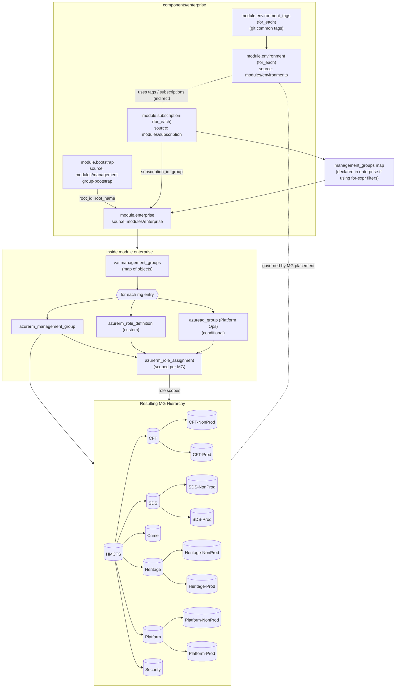

```mermaid
graph TD
%% Outer component layer
    subgraph COMPONENT [components/enterprise]
        BOOT["module.bootstrap<br/>source: modules/management-group-bootstrap"]
        SUBS["module.subscription (for_each)<br/>source: modules/subscription"]
        ENT["module.enterprise<br/>source: modules/enterprise"]
        TAGS["module.environment_tags (for_each)<br/>(git common tags)"]
        ENVS["module.environment (for_each)<br/>source: modules/environments"]
    end

    BOOT -->|root_id, root_name| ENT
    SUBS -->|subscription_id, group| ENT
    MGMAP["management_groups map<br/>(declared in enterprise.tf using for-expr filters)"]
    SUBS --> MGMAP --> ENT
    TAGS --> ENVS

%% Internal structure of enterprise module
    subgraph ENT_INT [Inside module.enterprise]
        VARS["var.management_groups<br/>(map of objects)"]
        VARS --> LOOP{{for each mg entry}}
        LOOP --> MGRES["azurerm_management_group"]
        LOOP --> ROLES["azurerm_role_definition (custom)" ]
        LOOP --> AAD["azuread_group (Platform Ops)<br/>(conditional)"]
        MGRES --> ASSIGN["azurerm_role_assignment<br/>(scoped per MG)"]
        ROLES --> ASSIGN
        AAD --> ASSIGN
    end
    ENT --> ENT_INT

%% Management group hierarchy
    subgraph HIERARCHY [Resulting MG Hierarchy]
        HMCTS[(HMCTS)]
        CFT[(CFT)]
        SDS[(SDS)]
        Crime[(Crime)]
        Heritage[(Heritage)]
        Platform[(Platform)]
        Security[(Security)]
        CFTNP[(CFT-NonProd)]
        CFTPD[(CFT-Prod)]
        SDSNP[(SDS-NonProd)]
        SDSPD[(SDS-Prod)]
        HeritageNP[(Heritage-NonProd)]
        HeritagePD[(Heritage-Prod)]
        PlatformNP[(Platform-NonProd)]
        PlatformPD[(Platform-Prod)]
    end

    MGRES --> HIERARCHY
    HMCTS --> CFT --> CFTNP
    CFT --> CFTPD
    HMCTS --> SDS --> SDSNP
    SDS --> SDSPD
    HMCTS --> Crime
    HMCTS --> Heritage --> HeritageNP
    Heritage --> HeritagePD
    HMCTS --> Platform --> PlatformNP
    Platform --> PlatformPD
    HMCTS --> Security

    ASSIGN -->|role scopes| HIERARCHY

    ENVS -. uses tags / subscriptions (indirect) .- SUBS
ENVS -. governed by MG placement .- HIERARCHY


```
